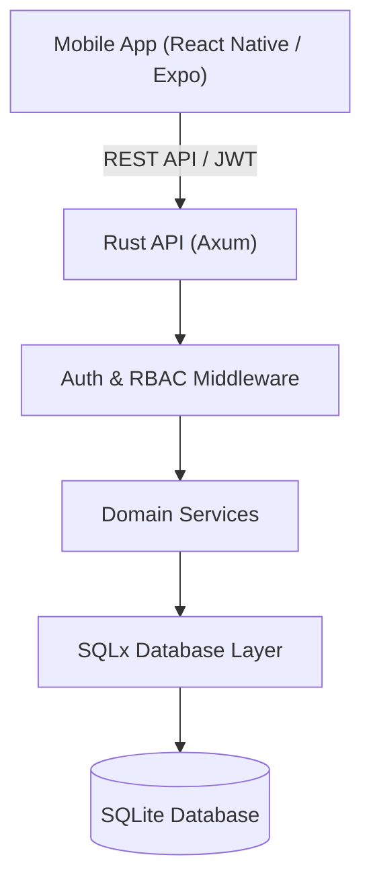

# Aero-Sense

**Aero-Sense** is a comprehensive digital identity, traceability, and component verification platform for the aviation industry. It bridges the gap between physical aircraft components and their digital records by providing a secure, multi-tenant ecosystem for lifecycle intelligence and maintenance tracking.

The platform centers on the concept of a **Digital Component Passport**, connecting physical components to cryptographically secure, tamper-evident maintenance and verification histories. By giving components a verifiable digital identity, Aero-Sense establishes trust in component provenance, ensures compliance, and improves overall aviation safety.

---

## 🚀 Quick Start

Ensure you have Rust, Node.js, and Expo installed.

```bash
# 1. Start the Backend
cd backend
cargo run

# 2. Start the Mobile Application
cd ../mobile
npm install
npx expo start
```
*Note: A demo tenant ("Skyline Aviation Group") and a Super Admin account are automatically seeded on first boot if `DEMO_SEED=true` is set in the backend environment.*

---

## 🎯 Problem Statement

The aviation maintenance industry suffers from fragmented component information, siloed databases, and paper-based traceability. Specifically:
- **Physical Verification:** It is difficult to cryptographically verify if a physical component matches its digital maintenance record.
- **Data Silos:** Different organizations (manufacturers, airlines, MROs) cannot easily trust or share lifecycle data securely.
- **Tamper Risks:** Historical maintenance logs and component passports are vulnerable to retroactive tampering.
- **Provenance:** Tracking the true lifecycle and transfer history of a component across different aircraft and tenants is complex and prone to human error.

## 💡 Solution

Aero-Sense resolves these challenges by introducing:
1. **Secure Component Identity:** Components are assigned a unique digital UUID mapped to physical identifiers (with future support for secure NFC tags).
2. **Digital Component Passport:** A unified digital record containing identity, association, and an immutable maintenance history.
3. **Cryptographic Integrity:** Every maintenance action is cryptographically hashed (SHA-256) and verified against a simulated on-chain registry to detect tampering.
4. **Role-Based Multi-Tenancy:** A strict, tenant-isolated architecture ensuring companies only interact with their own fleet, users, and components.
5. **Verification Pipeline:** An end-to-end audit trail tracking the authentication, binding, and integrity of components.

---

## ✨ Core Features

| Feature | Description | Status |
|---------|-------------|--------|
| **Multi-Tenancy** | Strict data isolation across different aviation companies. | ✅ Implemented |
| **Role-Based Access** | Hierarchical roles (Super Admin down to Viewer) with enforced backend middleware. | ✅ Implemented |
| **Fleet Management** | Registration and tracking of aircraft tied to specific companies. | ✅ Implemented |
| **Component Management** | Lifecycle tracking of physical components and aircraft assignments. | ✅ Implemented |
| **Digital Passport** | Aggregated view of component identity, maintenance, and verification history. | ✅ Implemented |
| **Maintenance Logging** | Immutable records of component inspections and maintenance actions. | ✅ Implemented |
| **Cryptographic Integrity** | SHA-256 hashing of maintenance records to prevent database tampering. | ✅ Implemented |
| **NFC Verification** | Physical-to-digital hardware scanning and authentication workflow. | 🟡 Mocked / Partial |
| **Component Transfers** | Secure transfer of components between different aviation companies. | 🔵 Planned |
| **IoT Telemetry** | Real-time sensor data ingestion for active components. | 🔵 Planned |
| **AI Predictions** | Remaining Useful Life (RUL) and anomaly detection intelligence. | 🔵 Planned |

---

## 🏗️ Architecture

Aero-Sense uses a modern, strictly-typed stack separating the mobile client from a highly secure backend.



### Backend (Rust)
Built with **Rust**, **Axum**, and **SQLx**. The backend acts as the absolute source of truth. It manages JWT issuance, Argone2 password hashing, strict multi-tenant authorization middleware (`company_id` validation), and cryptographic record hashing.

### Mobile (React Native)
Built with **React Native**, **Expo**, and **TypeScript**. State management is handled via **Zustand** (for authentication) and **TanStack React Query** (for data fetching and caching). Navigation uses React Navigation with dynamic, role-based Bottom Tab Shells.

### Complete Data Flow
`Manufacturer` registers a `Component` → Component is bound to an `Aircraft` → `NFC Tag` is assigned (mocked) → `Digital Passport` is generated → `Technician` logs `Maintenance` → Backend generates a `SHA-256 Hash` for the record → `Inspector` performs `Verification` against the physical tag and digital hash.

---

## 👥 User Roles

Aero-Sense relies on backend-enforced Role-Based Access Control (RBAC). 

**Platform Level:**
- `SUPER_ADMIN`: Manages the overall platform, registers new companies, and provisions the first Company Admin. Cannot access operational data.

**Tenant / Company Level:**
- `COMPANY_ADMIN`: Manages the company's users, aircraft fleet, and component inventory.
- `MANUFACTURER`: Registers new components and provisions NFC tags.
- `MAINTENANCE_TECHNICIAN`: Inspects components and submits immutable maintenance logs.
- `INSPECTOR`: Scans components and performs cryptographic integrity checks.
- `VIEWER`: Read-only access to fleet and component dashboards.

---

## 🏢 Multi-Tenancy

Data isolation is a core architectural pillar. The `companies` table represents individual tenants. The backend database schema associates every operational record (`users`, `aircraft`, `components`, `maintenance_records`, `verification_logs`) with a `company_id`.

The `company_id` is securely derived from the authenticated user's JWT payload by the backend middleware. Clients are never trusted to provide their own tenant identifiers, making cross-tenant data leakage impossible by design.

---

## 🔐 Authentication & Security

- **JSON Web Tokens (JWT):** Stateless authentication.
- **Argon2:** Advanced password hashing.
- **Middleware:** Axum extractors strictly validate route access (`require_role`, `require_company_scope`, `require_super_admin`).
- **Cryptographic Hashes:** Maintenance records are hashed via SHA-256. 
- **Storage:** No secrets or private keys are exposed to or stored permanently in the frontend application.

---

## 📡 NFC System & Verification Pipeline

**Note:** *The current NFC implementation uses a software mock abstraction (`NFC_MODE=mock`). Real NTAG 424 DNA cryptographic hardware authentication is deferred to a future phase.*

The verification pipeline bridges the physical and digital worlds. An Inspector initiates a scan, and the backend processes a pipeline of checks:
1. **NFC Authentication:** Validates the physical tag (currently simulated).
2. **Component Binding:** Verifies the tag matches the expected component UUID.
3. **Tamper Status:** Checks for physical tampering.
4. **Record Integrity:** Validates that the maintenance history hashes match the simulated on-chain registry.

**Outcomes:** `AUTHENTIC`, `SUSPICIOUS`, or `INVALID`.

---

## 📖 Digital Component Passport

The Passport aggregates a component's lifecycle into a single view:
- **Identity:** UUID, Serial Number, Manufacturer, Aircraft Association.
- **Maintenance History:** A ledger of all inspections, technician notes, and pass/fail results.
- **Integrity Validation:** On-demand verification of the maintenance record's SHA-256 hash against the stored registry.
- **Verification Logs:** Audit trail of previous NFC scans and their outcomes.

---

## 🗄️ Database Architecture

The system uses **SQLite** (configurable to PostgreSQL via SQLx). 

| Table | Purpose |
|-------|---------|
| `companies` | Tenant organizations. |
| `users` | Platform and company-scoped users. |
| `aircraft` | Fleet registry. |
| `components` | Physical component lifecycle tracking. |
| `component_tags` | NFC tag to component mappings. |
| `maintenance_records` | Immutable log of component maintenance. |
| `verification_logs` | Audit trail of scan attempts and results. |
| `blockchain_records` | Stored SHA-256 hashes simulating an immutable ledger. |

---

## 🔌 API Documentation

The backend exposes a secure REST API. 

*   **Auth:** `POST /api/auth/login`
*   **Companies (Super Admin):** `POST /api/companies`, `GET /api/companies/:id`, `POST /api/companies/:id/admins`
*   **Users:** `GET /api/users`, `POST /api/users`
*   **Aircraft:** `GET /api/aircraft`, `POST /api/aircraft`
*   **Components:** `GET /api/components`, `POST /api/components`, `GET /api/components/:id/history`
*   **Maintenance:** `POST /api/maintenance`
*   **Verification:** `POST /api/verification/nfc`, `POST /api/blockchain/verify`

*(All routes, except login, require an Authorization Bearer token).*

---

## ⚙️ Installation & Configuration

### Prerequisites
- Rust & Cargo
- Node.js (v18+) & npm
- Expo CLI

### 1. Backend Setup
```bash
cd backend
# The backend uses dotenvy. Modify .env as needed.
cargo run
```
*The SQLite database is automatically created and migrated on startup.*

### 2. Mobile Setup
```bash
cd mobile
npm install
npx expo start
```
*To test on a physical device, ensure your phone and development machine are on the same local network, and update any hardcoded IP addresses (e.g., `192.168.x.x`) to point to your machine.*

### Environment Variables

**Backend (`backend/.env`):**
```env
DATABASE_URL=sqlite://aircraft_verification.db?mode=rwc
PORT=8080
SUPER_ADMIN_EMAIL=admin@example.com
SUPER_ADMIN_PASSWORD=securepassword
DEMO_SEED=true
NFC_MODE=mock
```

**Mobile:** Configuration is largely driven by local constants pointing to the API URL. Public variables can be placed in `.env.local` as `EXPO_PUBLIC_*`.

---

## 🧪 Testing & Verification

The project enforces strict type checking and integrates comprehensive manual E2E verification workflows.

**Mobile Type Checking:**
```bash
cd mobile
npm run typecheck
```

### Database Persistence Verification
You can definitively prove that mobile actions are saved to the backend by querying the SQLite database directly:

1. **Verify Company Creation:**
   ```bash
   sqlite3 backend/aircraft_verification.db "SELECT id, name, slug FROM companies ORDER BY id DESC LIMIT 1;"
   ```
2. **Verify Aircraft Creation:**
   ```bash
   sqlite3 backend/aircraft_verification.db "SELECT id, registration_number, company_id FROM aircraft ORDER BY id DESC LIMIT 1;"
   ```
3. **Verify Maintenance Integrity Hash:**
   ```bash
   sqlite3 backend/aircraft_verification.db "SELECT id, maintenance_type, record_hash FROM maintenance_records ORDER BY id DESC LIMIT 1;"
   ```

---

## 📂 Project Structure

```text
Aero-Sense/
├── backend/                  # Rust / Axum API Server
│   ├── migrations/           # SQLx Database schemas
│   ├── src/
│   │   ├── db/               # Connection pooling
│   │   ├── middleware/       # JWT and RBAC enforcement
│   │   ├── models/           # DTOs and database models
│   │   ├── routes/           # REST endpoints
│   │   └── services/         # Core business logic
│   └── Cargo.toml            # Rust dependencies
├── mobile/                   # React Native / Expo Application
│   ├── src/
│   │   ├── api/              # Axios API clients mapped to backend routes
│   │   ├── components/       # Reusable UI (ErrorState, StatCard, etc.)
│   │   ├── hooks/            # Custom logic (useNfcVerification)
│   │   ├── navigation/       # Role-based Tab Shells & Stacks
│   │   ├── screens/          # Dashboard, Auth, Components, Maintenance, etc.
│   │   ├── store/            # Zustand state management
│   │   └── types/            # TypeScript interfaces aligned with Rust DTOs
│   └── package.json          # Node dependencies
└── e2e_test.js               # Standalone API integration test script
```

---

## 🛑 Limitations

- **Mock NFC:** True NTAG 424 DNA cryptographic hardware validation is currently bypassed via a software mock.
- **Simulated Blockchain:** The "blockchain" integrity checks currently rely on a traditional database table (`blockchain_records`) simulating an immutable ledger.
- **Local Environment:** Configured to run on SQLite and `localhost` by default for development efficiency.

---

## 🗺️ Roadmap

- **Phase 1:** Core Identity, Multi-Tenancy, and Backend (Completed)
- **Phase 2:** Mobile Operational Workflows & Dashboards (Completed)
- **Phase 3:** Integration of real NTAG 424 DNA hardware.
- **Phase 4:** Production database migration (PostgreSQL) and cloud deployment.
- **Phase 5:** Secure cross-tenant component transfer APIs (Resale provenance).
- **Phase 6:** IoT telemetry ingestion and AI-driven Anomaly/RUL predictions.

---

## ❓ FAQ

**What is Aero-Sense?**
It is a digital platform that binds physical aircraft components to a tamper-evident digital history, improving traceability and trust in aviation maintenance.

**Is the blockchain decentralized?**
Not currently. The system uses cryptographic hashing (SHA-256) stored in a secure central database table to simulate ledger behaviors and detect tampering.

**How does multi-tenancy work?**
The backend extracts a `company_id` from the secure JWT on every request and restricts database queries strictly to that tenant. A user can never access another company's data.

**Can the mobile app work offline?**
No. The backend is the absolute source of truth and enforces all logic and authorization. A network connection is required.
